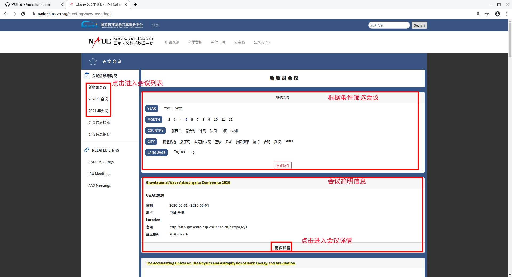
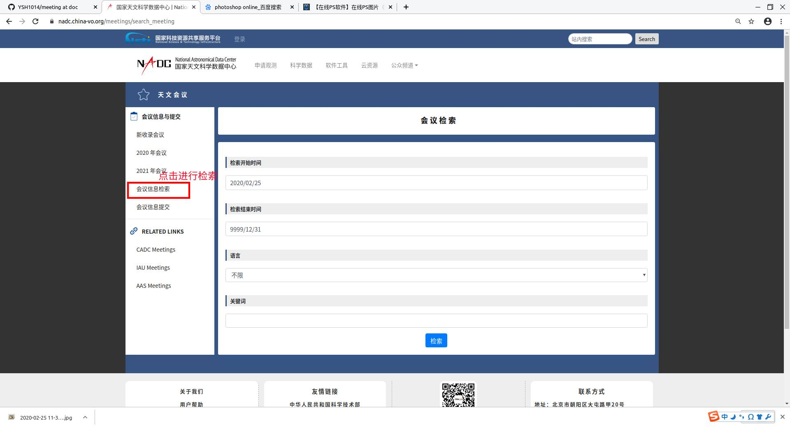
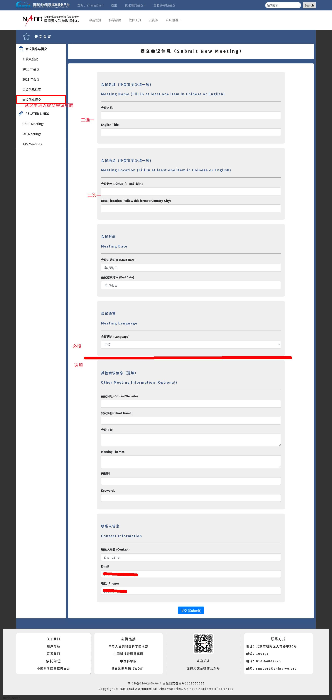
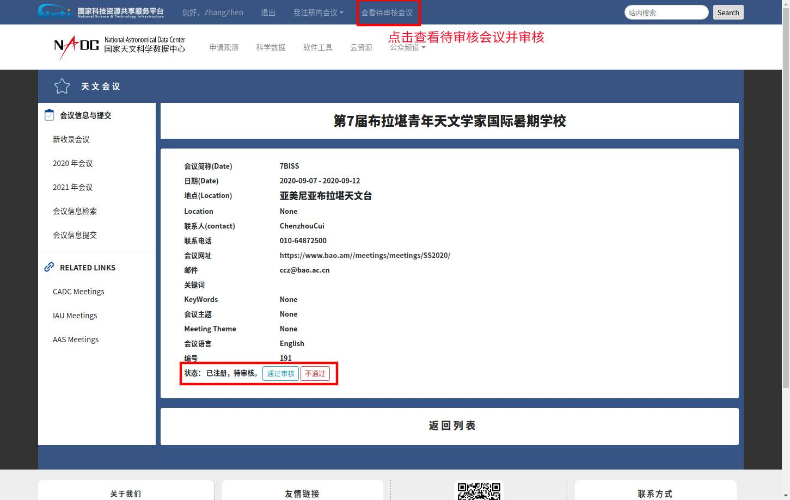

## 用例
___
### 用例图

___
### 角色
* 四类角色，权限为继承关系。由低到高分别是：
* tourist : 游客身份，只能浏览会议列表，查看会议信息。
* user : 普通用户登录，可以添加会议，更新会议。
* admin: 管理员，职责为审核会议
* root: 超级管理员，职责为添加、删除管理员

---
### 用例
* 浏览会议：

* 搜索会议：根据时间、语言、关键词进行搜索

* 添加和更新会议：已登录用户可通过左侧“会议信息提交”添加会议；在会议详情页可找到更新入口。其中，**会议标题，地点和时间为必填信息**，地点严格按照**国家-城市**的格式填写。部分信息分中英文，只需填写其中一项即可（建议**中英文都填写**）。注意，会议信息在修改后需要重新审核。

* 审核会议：管理员在顶部菜单可看到“查看待审核会议”，点击后进入待审核列表，与“浏览会议相同”。在详细信息页面与**官网和联系人**进行信息核实后，可点击 通过审核、不通过。另外，管理员需要**对信息进行补充**，例如有的会议只有中文或英文信息，管理员需要补充另一种语言。
